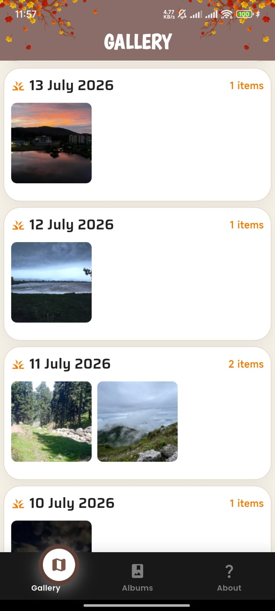
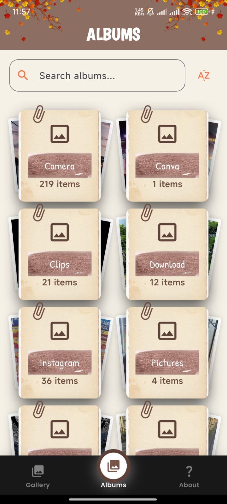
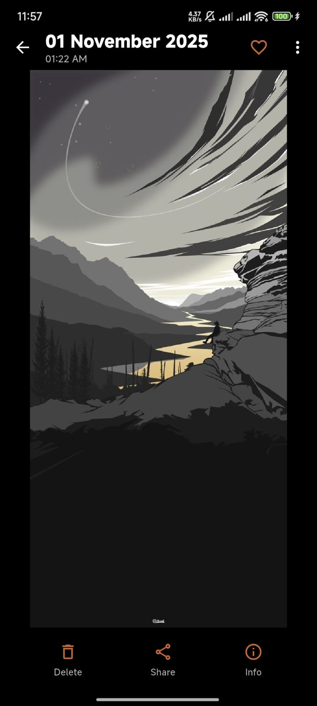

# Gallery

> A beautiful, modern Android gallery application built with Flutter.

Gallery is a lightweight photo and video gallery focused on clean design, smooth interactions, and an autumn-inspired interface. It provides an intuitive way to browse media while staying fast and responsive.

---

## Features

- 📷 Browse all photos and videos
- 📁 Album support
- ❤️ Favorite media
- 🗑️ Delete images and videos
- 📤 Share media
- 🎥 Built-in video player
- 🔍 Fullscreen image viewer with pinch-to-zoom
- ✅ Multi-selection
- 🔄 Real-time gallery updates
- 📅 Sort by newest or oldest
- 🎨 Autumn-themed UI
- ⚡ Smooth scrolling and optimized loading

---

## Screenshots

| Gallery | Albums | Viewer |
|---------|---------|---------|
|  |  |  | 

---

## Built With

- Flutter
- Provider
- Photo Manager
- Hive
- Chewie
- Video Player
- Flutter Animate
- Google Fonts

---

## Project Structure

```
lib/
├── app/
├── core/
├── features/
│   ├── gallery/
│   ├── albums/
│   ├── about/
│   ├── permissions/ 
|   ├── home/
|   ├── splash/
├── models/
├── shared/
└── main.dart
```

---

## Getting Started

Clone the repository

```bash
git clone https://github.com/TaH00R/gallery.git
```

Install dependencies

```bash
flutter pub get
```

Run the app

```bash
flutter run
```

---

## Requirements

- Android 8.0+
- Storage / Media permissions

## Contributing

Contributions, feature requests, and bug reports are welcome.

Feel free to open an issue or submit a pull request.

---

## License

This project is licensed under the MIT License.

---
